# cg-100 主要流程图

> 目录：`design/refactor/`｜子类：100 总体流程｜状态：草稿（待评审）
>
> 依据：当前工作树（`feat/portrait-recall-budget`，含未提交的"未完成中断封存 + 未完成并入召回"在制品）。
> 图后附"读图要点"，用于对照 `design/10`、`210`、`410`、`610`、`810`、`1010` 阅读；
> 文末列出**画图过程中发现的不一致**。
>
> 编号规则：本目录文档以 `cg-` 开头（cg = 重构），**每个子类按 100 起跳**（100/200/300…），
> **同一子类内按 1 或 2 递增**（如 101、102 或 201、202）。

## 0. 总览：两条端口

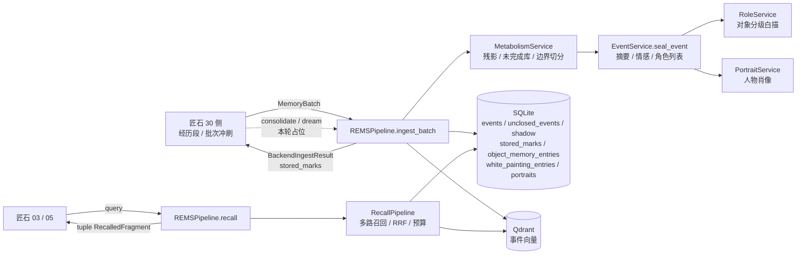

**读图要点**

- 写入与回忆是**两个互不耦合的端口**（design/210 §4）；回忆不写记忆单元，唯一写操作是"记忆恢复"。
- 后端的内部缓冲（残影 / 未完成事件）不整体跨端口；`unclosed_count` 只反映缓冲规模。
- `consolidate` / `dream` 为占位端口，本轮不实现（做梦代码保留不动）。

## 1. 写入：批次级 `ingest_batch`

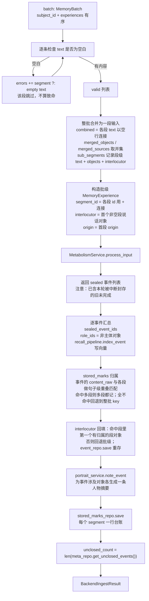

**读图要点**

- **整批合并**：一批经历合成一次代谢，不是"一段一次"，与 rems3 整批语义对齐；`stored_marks` 靠内容重叠把事件**归回**各 `segment_id`（一个事件可命中多段）。
- `stored_marks` 语义（design/610 §6）：封存几个填几个；本轮完全没封存则**不写该项**、不算错误。
- 失败隔离是**段级**的：空文本进 `errors`；整批代谢异常也进 `errors`，不抛穿调用方。
- `index_event`、`note_event`、`stored_marks` 保存都各自 try/except 进 `errors`，不阻断其余步骤。

## 2. 写入：代谢内部（残影 / 未完成生命周期）

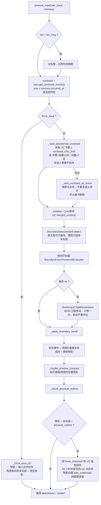

**读图要点**

- **封存在边界检测之前**：先按时间 / 说话人判定"旧挂起条目已经结束"，避免旧残影被拼进新话题（design/610 定稿 8）。
- 未完成库的重建规则：**残影 = 现有未完成条目的拼接**；模型没在 `new_unclosed` 里重新声明的旧条目按 trace decay 丢弃（防跨轮重复持有）。
- 三处"结束"语义并存：`force_save`（手动 / 兜底）、**中断封存**（时间 / 场景）、物理红线兜底。
- `_check_physical_redline` 是最后一道防线，即使认知层（评估 → 修复）失败也不允许缓冲无限膨胀。

## 3. 写入：边界结果落地 `_apply_boundary_result`

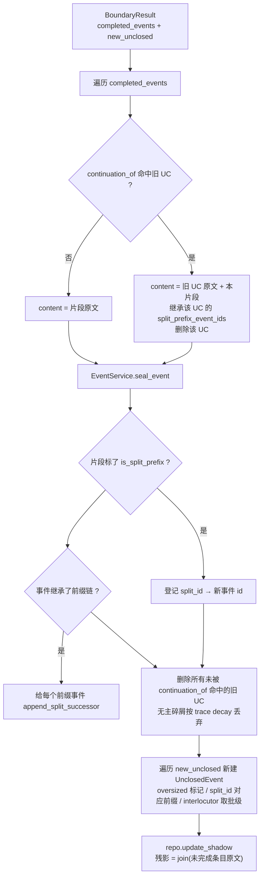

**读图要点**

- 80/20 分裂链路是**双向**的：前缀事件记 `split_successor_event_ids`，尾段闭环时把 `split_prefix_event_ids` 继承给新事件；回忆时锚点路会把这串前缀拉回来。
- `oversized` 只是**审计标记**，不再触发强制封存（旧版"越阈值就 force-seal"已废弃）。

## 4. 写入：事件封装 `EventService.seal_event`

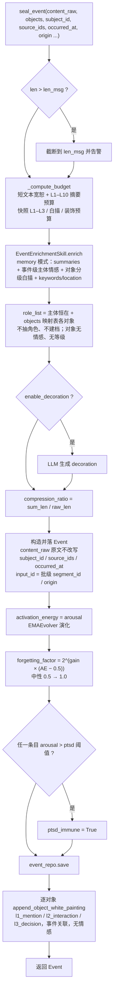

**读图要点**

- **原文保全**是不变量：`content_raw` 只做长度截断，不改写、不归一化（单事件场景 `content_raw == 输入 text`）。
- **主体恒在**：`role_list[0]` 恒为主体（`role_id = subject_id`，`is_subject=True`，importance S）；对象按 `objects` 映射表挂载，与文本是否提及无关；`objects` 空即"主体记忆"，同样合法。
- 摘要保留 L1–L10 多级衰减与熔断（design/610 定稿 2），对外至少保证 L1 可用。

## 5. 回忆：`recall` 管线

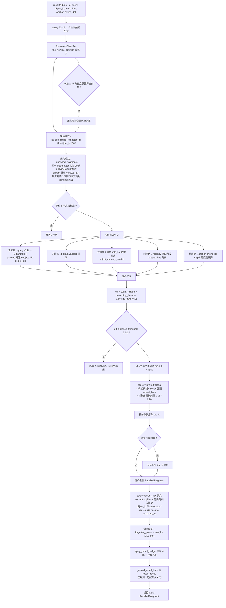

**读图要点**

- 未完成条目以 `kind="unclosed"` **直接排在片段列表最前**（`summary_level="raw"`，`content` 即挂起原文），这是本轮在制品的改动。
- **软纠偏有界**：只乘 1.15 / 0.90，不硬删；焦点对象或条目归属缺一即乘 1.0（退化为纯主题相关）。
- `score` 的四个因子互相独立：通道融合（RRF）、遗忘/疲态、情感、对象归属。
- 检索文本不是原文，而是 `L1 摘要 + 对象 id + 地点`（富化嵌入，design/1010 §2.4）；原文只在展示时给出。

## 6. 回忆：预算分配与肖像同场（1010 §8.5）

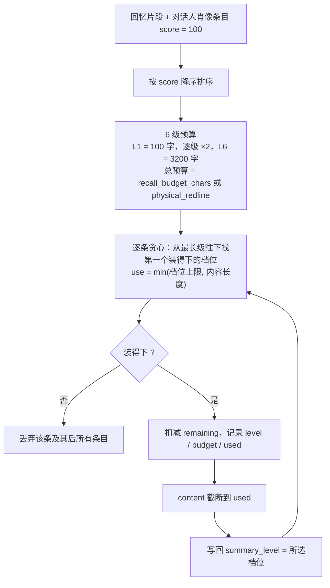

**读图要点**

- 口径统一：**L1 = 最短/最简，级数越高越详细**（与人物肖像一致）。
- 由于"能装最高级就装最高级"，短条目在小预算下也会被标成高档位（例如 L6）——这正是 `tests/unit/test_recall_trace.py::test_recall_persists_query_and_items` 当前失败的原因：测试仍期望 `L1`。

## 7. 人物肖像生成（1010 §8.4）

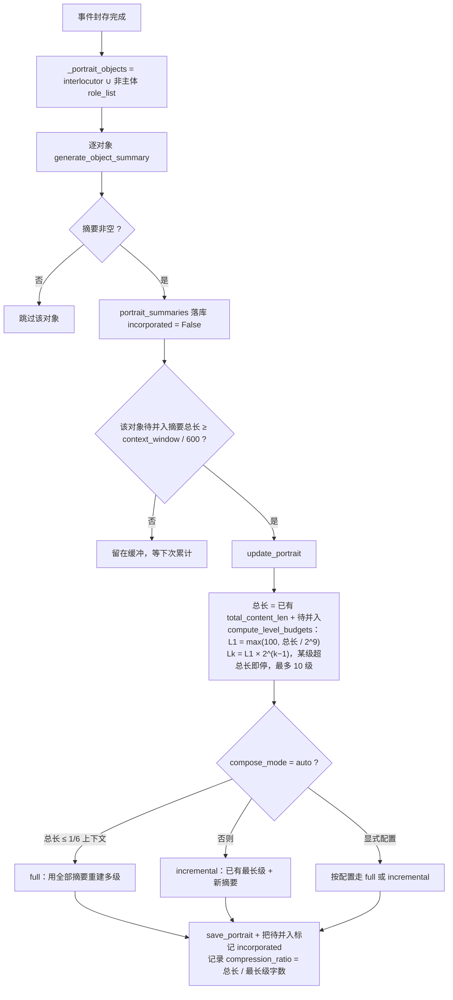

**读图要点**

- 肖像按**对象各一份**，彼此独立；`note_event` 的调用注释写"后台 / 并行，不阻塞 ingest"，实现上是**同进程同步调用**（LLM 在 ingest 请求路径上）。
- 两种疲态不共用：事件用 `event_fatigue`（只看整体负担），肖像用 `portrait_fatigue`（整体 + 对象合成）。

## 8. 遗忘与记忆恢复生命周期

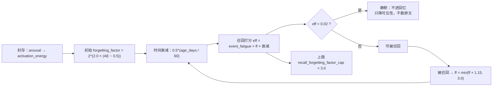

**读图要点**

- 情感只属主体且为事件级；对象无情感（design/410）。
- 强化是**温和且有上限**的：1.15 倍 / 上限 3.0，避免高频命中事件变成"永不遗忘"（历史上 1.5 倍 / 300 的问题）。
- `ptsd_immune` 事件走 `w_i = cap` 的免死路径（旧权重推导链，现记忆路径主要用 `forgetting_factor`）。

## 9. 墓碑（显式信念修正）

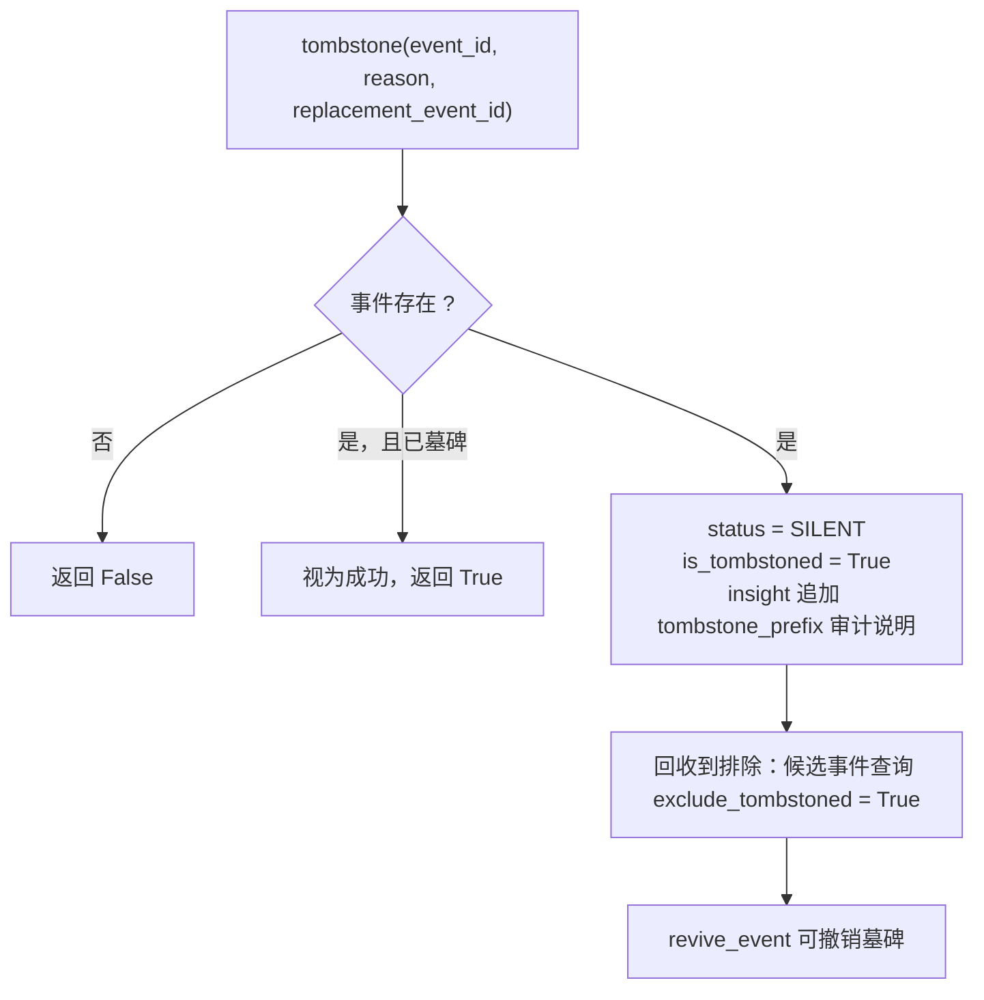

**读图要点**

- 只降可见性、**不删原文**；`insight` 里的 `[TOMBSTONE]` 前缀是审计线索。
- 与"自然演进"区分：偏好变化这类事实演进不用墓碑，靠白描时间序 + 遗忘自然让位。

## 10. 一次 `ingest_batch` 的调用顺序

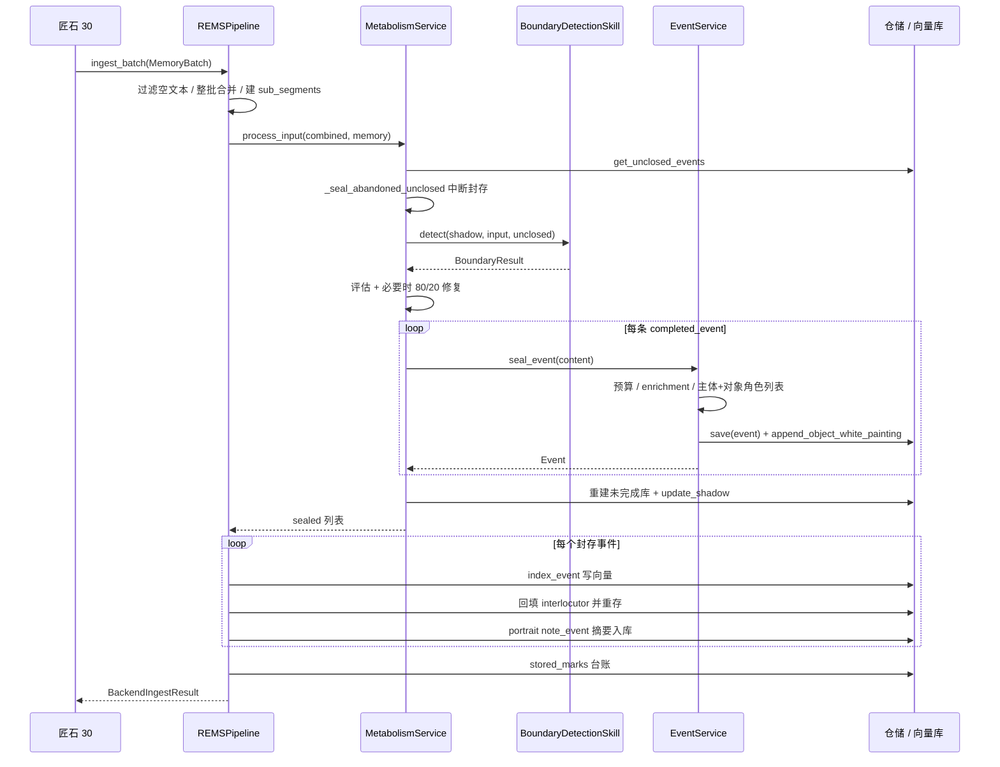

## 11. 画图时发现的不一致（建议后续拍板）

1. **说话人更换不再作为封存条件**（2026-09-20 已定）：未完成封存仅看单条字数上限与闲置规则；
   旧的 `unclosed_interlocutor_break_seal` 默认关闭且逻辑已移除。
2. **物理红线 / 陈旧封存走的是旧角色抽取路径**：`_check_physical_redline` 与 `_forget_stale_unclosed` 调
   `_seal_unclosed_as_event(memory=None, ...)`，于是 `seal_event` 走 `memory_mode = False` 分支，会调
   `RoleService.resolve_and_register` 抽角色、注册 `ROL-*`，绕过"主体恒在 + 01 对象映射表"，也与"不建角色系统"冲突。
3. **未完成条目是否跨端口，文档未同步**：`design/1010 §8.2` 已改成"相关未完成条目以 `kind=unclosed` 并入召回"，
   但 `design/210 §5/§6` 与 `design/610 §1.2(7)` 仍写"未完成 / 残影不跨端口暴露"。建议统一为"整段残影不跨端口，
   相关未完成条目可作 `kind=unclosed` 片段返回"。
4. **肖像生成并非后台**：`pipeline.ingest_batch` 注释称"后台 / 并行，不阻塞 ingest"，实为同步 LLM 调用；
   若真要在后台跑，需要线程 / 队列 + 会话安全（SQLite 已开 WAL，可支撑并发读）。
5. **`tests/unit/test_recall_trace.py` 期望值过期**：预算分配后 `summary_level` 为所选档位（示例中 L6），
   测试仍断言 `L1`；这是当前工作树唯一失败的用例。
